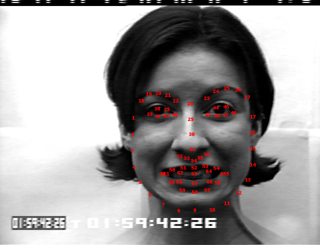
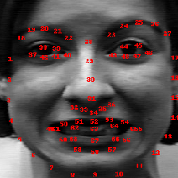
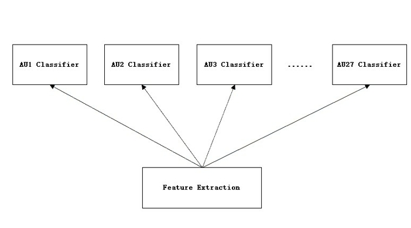
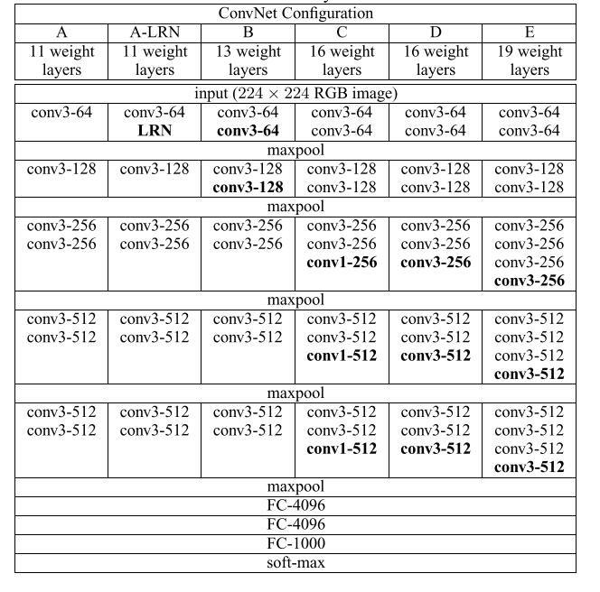
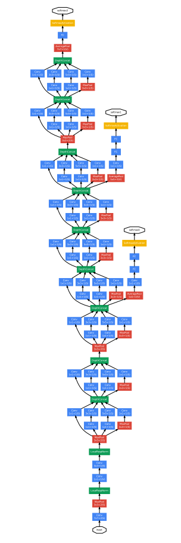
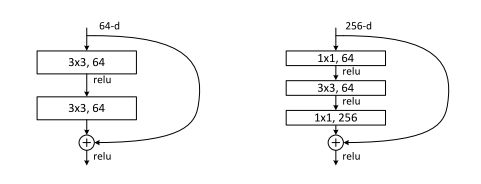

# AU_Recognition
AU_Recognition based on CKPlus/CK database


## Introduction

面部表情是个体之间交互的最自然的非语言交际媒体之一。表情能够表达情感，明确和强调所说的内容，并且表达理解、分歧和意图。机器对面部表情的理解将为描述个体的情绪状态和心理模式提供有力的信息。由于社交机器人，情感在线辅导环境，智能人机交互（HCI）等多种应用领域的巨大潜力，自动表情识别技术近来备受关注，成为热门话题[1]。

Facial expression is one of the most natural nonverbal communication media that individuals use to regulate interactions with each other. Expressions can express the emotions, clarify and emphasize what is being said, and signal comprehension, disagreement and intentions [1]. 

本文运用深度学习中迁移学习的技术对AU图像进行分类，达到了相对较好的结果。

In this work, AU images are classified using the technology of transfer learning and relatively good results are achieved.


## CKPlus Database

这个数据库是在 Cohn-Kanade Dataset 的基础上扩展来的，发布于2010年。这个数据库可以免费获取，包含表情的label和Action Units 的label。

This database is based on the Cohn-Kanade Dataset and was released in 2010. This database is available for free, including the label of the expression and the label of the Action Units.

这个数据库包括123个subjects, 593 个 image sequence，每个image sequence的最后一张 Frame 都有action units 的label，而在这593个image sequence中，有327个sequence 有 emotion的 label。这个数据库是人脸表情识别中比较流行的一个数据库，很多文章都会用到这个数据做测试。具体介绍可以参考文献[2]

The database contains 123 subjects, 593 image sequences, and the last frame of each image sequence has the label of action units. Of the 593 image sequences, there are 327 sequences with emotion. This database is a popular database for facial expression recognition. Many articles will use this data for testing. Specific introduction can refer to the literature [2]


现介绍对AU图像的预处理操作([take_a_look.ipynb](https://github.com/jiweibo/AU_Recognition/blob/master/take_a_look.ipynb))。

Now introduce the preprocess of AU image

### Preprocess

#### Label Preprocess

本文用到了593个image sequence的最后一张图像做为数据集。首先观察标签的分布，看是否均匀。统计结果如下

This work uses the last image of 593 image sequences as a dataset. First observe the distribution of the labels to see if they are balanced. The statistical results are as follows

```
AU1: 177
AU2: 117
AU4: 194
AU5: 102
AU6: 123
AU7: 121
AU9: 75
AU10: 21
AU11: 34
AU12: 131
AU13: 2
AU14: 37
AU15: 94
AU16: 24
AU17: 202
AU18: 9
AU20: 79
AU21: 3
AU22: 4
AU23: 60
AU24: 58
AU25: 324
AU26: 50
AU27: 81
AU28: 1
AU29: 2
AU30: 2
AU31: 3
AU34: 1
AU38: 29
AU39: 16
AU43: 9
AU44: 1
AU45: 17
AU54: 2
AU61: 1
AU62: 2
AU63: 2
AU64: 4
```


数据和图中皆反映出AU分布非常不均匀，在此，只选择数量大于90的AU作为数据集。

The data and graphs all reflect that the AU distribution is very unbalcanced. Here, only AUs with a number greater than 90 are selected as the dataset.


最终，要识别的AU有：1, 2, 4, 5, 6, 7, 12, 15, 17, 25

In the end, the AUs to identify are: 1, 2, 4, 5, 6, 7, 12, 15, 17, 25


还需要对label进行One-hot处理,在此不做介绍。

One-hot processing of the label is also required and will not be described here.

#### Image Preprocess

CKPlus中的数据集为灰度图，此外，根据landmark将脸部附近区域提取出来，之后需要resize成网络模型需要的大小，最后转为RGB图。

The dataset in CKPlus is a grayscale image. In addition, the region near the face is extracted from the landmark, and then it needs to be resized to the size required by the network model and finally converted to an RGB image.







## Model Architecture

使用alexnet、vgg、resnet和inception网络架构作为特征提取器， 最终并接上10个逻辑回归单元对上述提到的每个AU进行分类。

Using the alexnet, vgg, resnet, and inception network architectures as feature extractors, 10 logistic regression units are eventually connected to classify each of the aforementioned AUs.

总体模型架构如图所示

The model architecture as shown



### AlexNet


### VGG



### Inception

inception基本单元

inception cell




### ResNet

resnet基本单元

resnet cell




## Usage

```
usage: main.py [-h] [--model MODEL] [--epochs N] [--step N] [--start-epoch N]
               [-b N] [--lr LR] [--resume PATH] [-e]
               DATA_DIR LABEL_DIR LANDMARK_DIR

AU Recognition

positional arguments:
  DATA_DIR              path to data dir
  LABEL_DIR             path to label dir
  LANDMARK_DIR          path to landmark dir

optional arguments:
  -h, --help            show this help message and exit
  --model MODEL         alexnet or vgg16 or vgg16_bn or vgg19 or res18 or
                        res50 or res101 or inception
  --epochs N            numer of total epochs to run
  --step N              numer of epochs to adjust learning rate
  --start-epoch N       manual epoch number (useful to restarts)
  -b N, --batch-size N  mini-batch size (default: 32)
  --lr LR, --learning-rate LR
                        initial learning rate
  --resume PATH         path to latest checkpoitn, (default: None)
  -e, --evaluate        evaluate model on validation set
```

for example

```
python main.py E:\DataSets\CKPlus\cohn-kanade-images E:\DataSets\CKPlus\FACS_labels\FACS E:\DataSets\CKPlus\Landmarks\Landmarks --model alexnet --epochs 100 -b 16 --step 10

E:\DataSets\CKPlus\cohn-kanade-images E:\DataSets\CKPlus\FACS_labels\FACS E:\DataSets\CKPlus\Landmarks\Landmarks --model alexnet --epochs 50 -b 16 --step 10 --lr 0.01 --kfold 7

python main.py E:\DataSets\CKPlus\cohn-kanade-images E:\DataSets\CKPlus\FACS_labels\FACS E:\DataSets\CKPlus\Landmarks\Landmarks --model res18 --epochs 50 -b 16 --step 10 --lr 0.01
```


## Experiments

<table>
    <tr>
        <th>Model</th>
        <th>AU1</th>
        <th>AU2</th>
        <th>AU4</th>
        <th>AU5</th>
        <th>AU6</th>
        <th>AU7</th>
        <th>AU12</th>
        <th>AU15</th>
        <th>AU17</th>
        <th>AU25</th>
    </tr>
    <tr>
        <th>AlexNet</th>
        <th>0.83</th>
        <th>0.88</th>
        <th>0.8</th>
        <th>0.72</th>
        <th>0.74</th>
        <th>0.63</th>
        <th>0.86</th>
        <th>0.64</th>
        <th>0.88</th>
        <th>0.92</th>
    </tr>
    <tr>
        <th>VGG16</th>
        <th>0.81</th>
        <th>0.83</th>
        <th>0.71</th>
        <th>0.64</th>
        <th>0.69</th>
        <th>0.5</th>
        <th>0.76</th>
        <th>0.52</th>
        <th>0.83</th>
        <th>0.88</th>
    </tr>
    <tr>
        <th>VGG16_BN</th>
        <th>0.78</th>
        <th>0.86</th>
        <th>0.75</th>
        <th>0.71</th>
        <th>0.7</th>
        <th>0.55</th>
        <th>0.78</th>
        <th>0.52</th>
        <th>0.79</th>
        <th>0.89</th>
    </tr>
    <tr>
        <th>Res18</th>
        <th>0.69</th>
        <th>0.79</th>
        <th>0.52</th>
        <th>0.71</th>
        <th>0.62</th>
        <th>0.48</th>
        <th>0.66</th>
        <th>0.24</th>
        <th>0.57</th>
        <th>0.8</th>
    </tr>
    <tr>
        <th>Res50</th>
        <th>0.73</th>
        <th>0.84</th>
        <th>0.62</th>
        <th>0.67</th>
        <th>0.59</th>
        <th>0.52</th>
        <th>0.66</th>
        <th>0.45</th>
        <th>0.66</th>
        <th>0.83</th>
    </tr>
    <tr>
        <th>Res101</th>
        <th>0.69</th>
        <th>0.78</th>
        <th>0.65</th>
        <th>0.7</th>
        <th>0.5</th>
        <th>0.5</th>
        <th>0.64</th>
        <th>0.33</th>
        <th>0.68</th>
        <th>0.8</th>
    </tr>
    <tr>
        <th>inception</th>
        <th>0.45</th>
        <th>0.45</th>
        <th>0.31</th>
        <th>0.22</th>
        <th>0.12</th>
        <th>0.11</th>
        <th>0.17</th>
        <th>0</th>
        <th>0.26</th>
        <th>0.7</th>
    </tr>
</table>

AlexNet is OK

VGG overfit

Inception and Resnet should reconsider the classifier layer and hyper parameters.


## Acknowledgements

[1] Facial action unit recognition under incomplete data based on multi-label learning with missing labels

[2] The Extended Cohn-Kanade Dataset (CK+): A complete dataset for action unit and emotion-specified expression

[3] ImageNet Classification with Deep Convolutional Neural Networks

[4] VERY DEEP CONVOLUTIONAL NETWORKS FOR LARGE-SCALE IMAGE RECOGNITION

[5] Deep Residual Learning for Image Recognition

[6] Going deeper with convolutions
